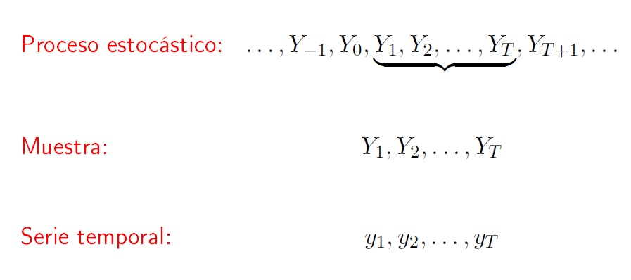

```{r setup, include=FALSE}
knitr::opts_chunk$set(echo = FALSE, warning=FALSE, message=FALSE)
```

```{r librerias, echo = FALSE, warning=FALSE, message=FALSE}
if (! ('pacman' %in% installed.packages())) install.packages('pacman')
pacman::p_load(tidyverse, kableExtra, quantmod, fredr, patchwork, fpp2)
```

## Tipo de Cambio Nominal

- El comportamiento del tipo de cambio es lejos de ser sistemático y predecible

```{r er0librerias, echo = FALSE, warning=FALSE, message=FALSE, include=FALSE}
#Cargamos los datos
list.files(path = "/cloud/project/data/", full.names = TRUE) %>%
  map(load,.GlobalEnv)

```

```{r er1, warning=FALSE, message=FALSE, fig.align='center', fig.width=12, fig.height=7.5}

plot(index(euro_dolar),as.numeric(euro_dolar[,6]),typ='l',xlab='',ylab='EUR/USD', main = "Tipo de Cambio Euro/Dólar")


```

---

## Tipo de Cambio Nominal

- El comportamiento del tipo de cambio es lejos de ser sistemático y predecible

```{r er2, warning=FALSE, message=FALSE, fig.align='center', fig.width=12, fig.height=7.5}

plot(index(euro_libra),as.numeric(euro_libra[,6]),typ='l',xlab='',ylab='EUR/GBP', main = "Tipo de Cambio Euro/Libra")


```

---

## Tipo de Cambio Nominal

- El comportamiento del tipo de cambio es lejos de ser sistemático y predecible

```{r er3, warning=FALSE, message=FALSE, fig.align='center', fig.width=12, fig.height=7.5}

plot(index(euro_yen),as.numeric(euro_yen[,6]),typ='l',xlab='',ylab='EUR/JPY', main = "Tipo de Cambio Euro/Yen")


```

---

## Tipo de Cambio Nominal

- Aunque sus variaciones presentan un comportamiento más predecible

```{r er4, warning=FALSE, message=FALSE, fig.align='center', fig.width=12, fig.height=7.5}

plot(index(euro_dolar),as.numeric(euro_dolar[,7]),typ='l',xlab='',ylab='EUR/USD', main = "Variación del Tipo de Cambio Euro/Dólar")

```

---

## Tipo de Cambio Nominal

- Aunque sus variaciones presentan un comportamiento más predecible

```{r er5, warning=FALSE, message=FALSE, fig.align='center', fig.width=12, fig.height=7.5}

plot(index(euro_libra),as.numeric(euro_libra[,7]),typ='l',xlab='',ylab='EUR/GBP', main = "Variación del Tipo de Cambio Euro/Libra")

```

---

## Tipo de Cambio Nominal

- Aunque sus variaciones presentan un comportamiento más predecible

```{r er6, warning=FALSE, message=FALSE, fig.align='center', fig.width=12, fig.height=7.5}

plot(index(euro_yen),as.numeric(euro_yen[,7]),typ='l',xlab='',ylab='EUR/USD', main = "Variación del Tipo de Cambio Euro/Yen")

```

---

## Proceso estocástico y serie temporal

- Una serie temporal es una colección de observaciones de una variable tomadas de forma secuencial y ordenada en el tiempo (instantes de tiempo equiespaciados). Las series pueden tener una periodicidad anual, semestral, trimestral, mensual, semanal, diaria etc., según los periodos de tiempo en los que están recogidos los datos que la componen.

- Un proceso estocástico es una secuencia de variables aleatorias, ordenadas y equidistantes cronológicamente referidas a una característica observable en diferentes momentos.

- Por ello, una serie temporal es una **realización particular de una muestra procedente de un proceso estocástico.**


---

## Proceso estocástico y serie temporal

- Una serie temporal es una realización particular de un proceso estocástico

```{r proceso01, warning=FALSE, message=FALSE, fig.align='center', fig.width=12, fig.height=7.5}

# Parámetros
phi= -0.7048                                 
y=rep(0,100)
cons=2.1                                     
y[1]=4.1

#Creamos un data frame vacio que luego rellenamos con distintas realizaciones de series temporales
datos <- matrix(0, nrow = 100, ncol = 10) %>% data.frame()

for (i in 1:10) {
  datos[1,i]=4.1
  e=rnorm(n=100,0,0.7) 
  for (j in 2:100) datos[j,i]=cons+phi*datos[j-1,i]+e[j]   
}

plot(datos[,1] %>% ts(), col=2, lwd=3, main="Proceso Estocástico", xlab="Tiempo", ylab="Serie")

```

---

## Proceso estocástico y serie temporal

- Una serie temporal es una realización particular de un proceso estocástico

```{r proceso02, warning=FALSE, message=FALSE, fig.align='center', fig.width=12, fig.height=7.5}

plot(datos[,1] %>% ts(), col=2, lwd=3, main="Proceso Estocástico", xlab="Tiempo", ylab="Serie")
lines(datos[,2] %>% ts(), col=3)

```


---

## Proceso estocástico y serie temporal

- Una serie temporal es una realización particular de un proceso estocástico

```{r proceso03, warning=FALSE, message=FALSE, fig.align='center', fig.width=12, fig.height=7.5}

plot(datos[,1] %>% ts(), col=2, lwd=3, main="Proceso Estocástico", xlab="Tiempo", ylab="Serie")
lines(datos[,2] %>% ts(), col=3)
lines(datos[,3] %>% ts(), col=4)

```


---

## Proceso estocástico y serie temporal

- Una serie temporal es una realización particular de un proceso estocástico

```{r proceso04, warning=FALSE, message=FALSE, fig.align='center', fig.width=12, fig.height=7.5}

plot(datos[,1] %>% ts(), col=2, lwd=5, main="Proceso Estocástico", xlab="Tiempo", ylab="Serie")
for (i in 2:10) {
  lines(datos[,i] %>% ts(), col=i+1)
}

```


---

## Proceso estocástico y serie temporal



---


## Proceso estocástico y serie temporal


  - Elaborar un **modelo estadístico** para una muestra procedente de un proceso estocástico $Y_t$ a partir de una única realización particular (una serie temporal $y_t$).
  
  - Utilizar el modelo elaborado para **prever** los futuros valores de proceso $Y_{(N+l)}$.
  
  - **Contrastar** alguna teoría sobre la característica o variable a la que se refiere la serie considerada.
  
  
---


## Proceso estocástico y serie temporal

### ¿Cómo lo vamos a hacer?

- Para conseguir estos objetivos se va a seleccionar un modelo para la muestra dentro de una clase general de modelos denominados ARIMA, que implique cierta propiedades teóricas para el proceso estocástico $Y_t$ del que procede la muestra y que resulten compatibles con las propiedades muestrales observadas en la serie temporal $y_t$.

- El problema para hacer esto es que solo tenemos una única realización particular del proceso estocástico. Para solucionar esto necesitamos que se cumpla la hipótesis de estacionariedad.
  
  
---

## Estacionariedad: Definición


Si $\{y_t\}$ es una serie temporal estacionaria, entonces para todo $s$, la distribución de $(y_t,\dots,y_{t+s})$ no depende de $t$.


Una **serie estacionaria** es:

*  aproximadamente horizontal
*  varianza constante
*  no hay patrones predecibles a largo plazo 
---

## ¿Estacionario?

```{r fig.width=12, fig.height=7.5}
autoplot(dj) + ylab("Dow Jones Index") + xlab("Día")
```

---

## ¿Estacionario?

```{r fig.width=12, fig.height=7.5}
autoplot(diff(dj)) + ylab("Cambio en el Dow Jones Index") + xlab("Día")
```

---


## ¿Estacionario?
```{r fig.width=12, fig.height=7.5}
autoplot(eggs) + xlab("Año") + ylab("$") +
  ggtitle("Precio de una docena de huevos en dólares de 1993")
```

---


## ¿Estacionario?

```{r fig.width=12, fig.height=7.5}
autoplot(window(ausbeer, start=1992)) + xlab("Año") + ylab("megalitros") +
  ggtitle("Producción trimestral de cerveza en Australia")
```


---

## Estacionariedad: Definición


Si $\{y_t\}$ es una serie temporal estacionaria, entonces para todo $s$, la distribución de $(y_t,\dots,y_{t+s})$ no depende de $t$.


Una **serie estacionaria** es:

*  aproximadamente horizontal
*  varianza constante
*  no hay patrones predecibles a largo plazo 
---

## Estacionariedad: Definición (más formal)

- Un proceso estocástico $(Y_t)$ es **estrictamente estacionario** si y sólo si para cualesquiera $n \geq 1$ momentos $t_1<t_2< \ldots t_n$ de su historia, la distribución de probabilidad conjunta de $[Y_{t_1}, Y_{t_2}, \ldots, Y_{t_n}]'$ coincide con la de $[Y_{t_1+h}, Y_{t_2+h}, \ldots, Y_{t_n+h}]'$ para cualquier número entero $h=\pm 1, \pm 2, \ldots$ (distinto de cero).

---

## Estacionariedad: Definición (más formal)

- Un proceso estocástico $(Y_t)$ con $E(Y_t) < \infty$ para todo $t=\pm 1, \pm 2, \ldots$ es **estacionario en media** o **débilmente estacionario de primer orden** si y solo si $E(Y_t)$ es constante (no depende de $t$) para todo $t=\pm 1, \pm 2, \ldots$.

- Un proceso estocástico $(Y_t)$ con $E(Y^2_t) < \infty$ para todo $t= \pm 1, \pm 2, \ldots$ es **estacionario en autocovarianza** o **débilmente estacionario de segundo orden** si y solo si:

   - $E(Y_t)$ y $Var(Y_t)$ son constantes (no depende de $t$) para todo $t= \pm 1, \pm 2, \ldots$.

   - $Cov(Y_t, Y_{t+k})$ depende a lo sumo de $k$ pero no de $t$ para todo $t=\pm 1, \pm 2, \ldots$.

---

## Estacionariedad: Definición (más formal)

- Un proceso estocástico $(Y_t)$ es **normal** o **gaussiano** cuando para cualesquiera $n \geq 1$ momentos $t_1<t_2< \ldots t_n$ de su historia, la distribución de probabilidad conjunta de $[Y_{t_1}, Y_{t_2}, \ldots, Y_{t_n}]'$ es una distribución normal $n-$variante.

> <span style="color:red"> Estacionariedad en autocovarianza + Normalidad $\Rightarrow$ Estacionariedad Estricta </span>

---


## Propiedades  de la hipótesis de estacionariedad

   - <span style="color:red">**Estacionariedad**</span>: cierto estado de equilibrio estadístico que caracteriza la evolución temporal de un proceso estocástico que ha genera una serie temporal.
   
   -  <span style="color:red">**Media**</span>: valor constante en el tiempo que mide el nivel alrededor del cual evoluciona un proceso estocástico estacionario.
   
   -  <span style="color:red">**Varianza**</span>: valor constante en el tiempo que mide la dispersión o la variabilidad de la evolución temporal de un proceso estocástico estacionario alrededor de su media.
   
   -  <span style="color:red">**Autocorrelaciones**</span>: valores constantes en el tiempo que miden el grado de asociación lineal entre cada par de componentes de un proceso estocástico estacionario separados por diferentes intervalos temporales o retardos.

---


## Proceso ruido blanco

- Ruido blanco $x_t = w_t$

- Donde $E(w_t)=0\;\;\; var(w_t)=\sigma^2 \;\;\; \forall t$

```{r ruido01, warning=FALSE, message=FALSE, fig.align='center', fig.width=12, fig.height=7.5}

w = rnorm(500,0,1)

plot(w %>% ts, main="Ruido Blanco", xlab="Tiempo", ylab="Serie")

```


---

## Proceso ruido blanco

- Lo vemos con menos datos para que se visalize mejor

```{r ruido02, warning=FALSE, message=FALSE, fig.align='center', fig.width=12, fig.height=7.5}

w1 = rnorm(100,0,1)

plot(w1 %>% ts, main="Ruido Blanco", xlab="Tiempo", ylab="Serie", type="b", col=2)

```


---

## Proceso ruido blanco con deriva (drift)

- Ruido blanco con deriva $x_t =\delta +  w_t$

```{r ruido03, warning=FALSE, message=FALSE, fig.align='center', fig.width=12, fig.height=7.5}

delta = 2
ww = w + delta
plot(ww %>% ts, main="Ruido Blanco con deriva", xlab="Tiempo", ylab="Serie", type="l", col=1)

```

---

## Proceso media movil

- Media móvil $x_t =  \theta w_t$

- En este caso particular el proceso es $x_t =\frac{1}{3} (w_{t-1}+w_t+w_{t+1})$. Se puede interpretar como una media centrada en cada observación


```{r ma01, warning=FALSE, message=FALSE, fig.align='center', fig.width=12, fig.height=6.5}

v = stats::filter(w, sides=2, rep(1/3,3))

plot(v %>% ts, main="Media Móvil", xlab="Tiempo", ylab="Serie", type="l", col=1)

```

---

## Ambos procesos

```{r ma02, warning=FALSE, message=FALSE, fig.align='center', fig.width=12, fig.height=7.5}

par(mfrow=c(2,1))
plot(w %>% ts, main="Ruido Blanco", xlab="Tiempo", ylab="Serie", type="l", col=1)
plot(v %>% ts, main="Media Móvil", xlab="Tiempo", ylab="Serie", type="l", col=2)

```

---

## Procesos autoregresivos 

- Proceso autoregresivo de orden 2 $x_t = x_{t-1} - 0.9x_{t-2} + w_t$

```{r ar01, warning=FALSE, message=FALSE, fig.align='center', fig.width=12, fig.height=7.5}

phi= -0.9          
z=rep(0,500)                                 
z[1]=0
z[2]=2
for (i in 3:500) z[i]=z[i-1]+phi*z[i-2]+w[i]   
plot(ts(z), main="Proceso autoregresivo", xlab="tiempo", ylab="Serie")  

```


---

## Random walk (Paseo aleatorio)

- Paseo aleatorio $x_t = x_{t-1} + w_t$

- Paseo aleatorio con deriva $x_t = \delta+ x_{t-1} + w_t$

```{r rw01, warning=FALSE, message=FALSE, fig.align='center', fig.width=12, fig.height=7.5}

set.seed(123)
TT <- 500
zz <- xx <- ww <- rnorm(n = TT, mean = 0, sd = 1)
for (t in 2:TT) {
  xx[t] <- xx[t - 1] + ww[t]
}
delta=0.2
for (t in 2:TT) {
  zz[t] <- delta + zz[t - 1] + ww[t]
}
plot(xx %>% ts, type="l", ylim=c(-20,100) ,ylab = "Series", xlab="Tiempo", main="Paseo Aleatorio")
lines(zz %>% ts)
lines(delta*(0:500), lty = "dashed", col=2)


```

